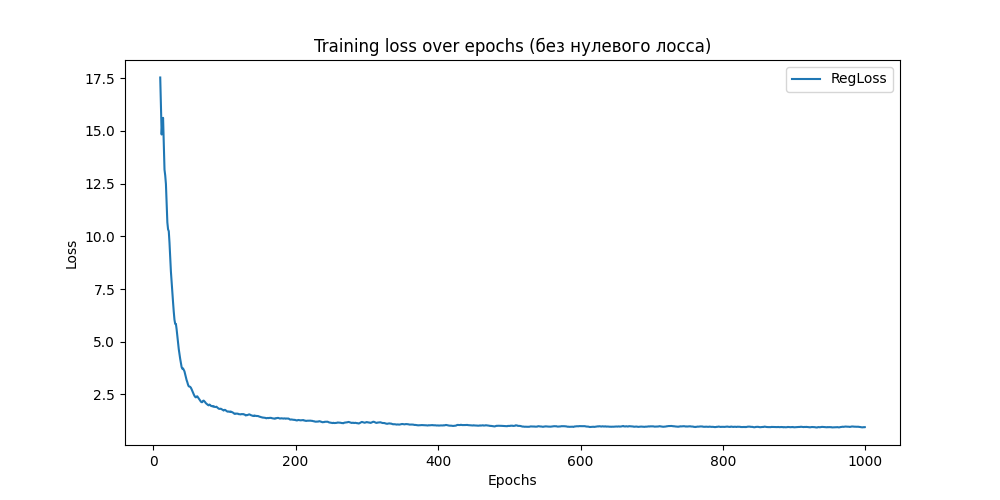
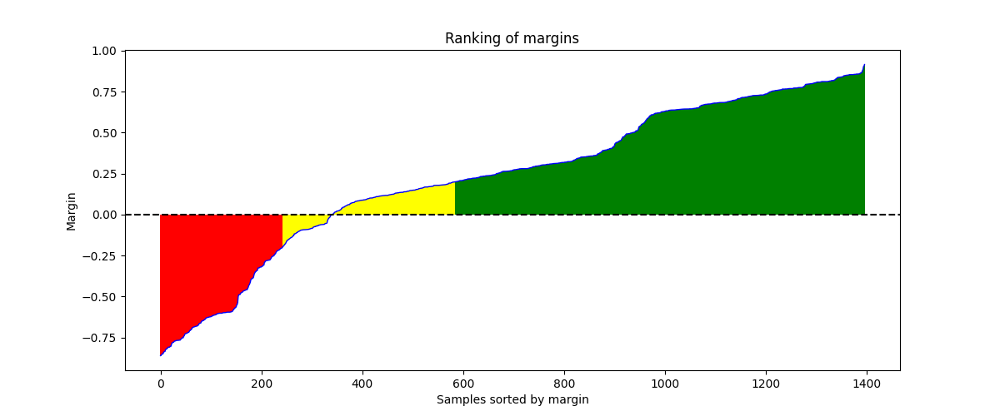

# Лабораторная работа 1: Линейная классификация

## Задачи
- Выбрать датасет для классификации (например, с Kaggle).  
- Реализовать вычисление отступа объекта (визуализировать и проанализировать).  
- Реализовать вычисление градиента функции потерь.  
- Реализовать рекуррентную оценку функционала качества.  
- Реализовать метод стохастического градиентного спуска с инерцией.  
- Реализовать L2 регуляризацию.  
- Реализовать скорейший градиентный спуск.  
- Реализовать предъявление объектов по модулю отступа.  
- Обучить линейный классификатор на выбранном датасете.  
- Обучить с инициализацией весов через корреляцию.  
- Обучить со случайной инициализацией весов через мультистарт.  
- Обучить со случайным предъявлением и с предыдущим шагом.  
- Оценить качество классификации.  
- Сравнить лучшую реализацию с эталонной (sklearn).  
- Подготовить отчет.

## Структура датасета
**Ссылка на датасет:** [Employee Dataset на Kaggle](https://www.kaggle.com/datasets/tawfikelmetwally/employee-dataset)  

**Описание:**  
Датасет содержит информацию о сотрудниках компании: образование, опыт работы, демографические данные и факторы, связанные с трудовой деятельностью. Данные анонимизированы, чтобы сохранить конфиденциальность.

**Столбцы:**
- `Education` — образование сотрудника (степень, институт, специальность).  
- `Joining Year` — год начала работы, показывает стаж.  
- `City` — город работы сотрудника.  
- `Payment Tier` — уровень оплаты.  
- `Age` — возраст.  
- `Gender` — пол.  
- `Ever Benched` — был ли сотрудник без работы временно.  
- `Experience in Current Domain` — опыт в текущей сфере.  
- `Leave or Not` — целевая переменная (отметка об увольнении/оставании).

**Обработка датасета:**
- Категориальные колонки (`Education`, `Gender`, `EverBenched`) были закодированы числами.  
- Для `City` использован one-hot encoding.  
- Целевая переменная `LeaveOrNot`: 0 → -1.  
- `JoiningYear` преобразован в количество лет стажа.  
- Дубликаты не удалялись, так как повторяющиеся паттерны несут ценность.  
- Разделение на train/test: 70%/30%.

## Архитектура решения
Проект состоит из трёх основных файлов:

- **app.py** — главный файл проекта, отвечает за запуск обучения классификатора и анализ результатов.  
- **utils.py** — вспомогательные функции: загрузка датасета, подготовка данных, тренировка модели, расчет метрик.  
- **ModelsClasses.py** — определение абстрактного класса `Classifier` и его конкретной реализации `ClassifierLogisticReg`.  

**Особенности реализации:**
- Линейный классификатор с метками ±1.  
- Методы: вычисление градиента, лосс-функция с L2 регуляризацией, стохастический градиентный спуск с мини-батчами и инерцией.  
- Инициализация весов: через корреляцию или случайно с мультистартом.  
- Возможность батчевой тренировки с учетом марджинов или случайным выбором.  
- Визуализация распределения марджинов и графика ошибки обучения.

### Диаграмма классов


---

## Результаты
- Достигнуты показатели, близкие к эталонной реализации sklearn:  
  **Accuracy ≈ 0.75**.  
- Визуализация марджинов показывает распределение надёжных, пограничных и шумовых объектов.     
### Экранные формы
График изменения ошибки

График отклонений

Показатели лучшей модели


 
---

## Быстрый старт
1. Установить зависимости:
```bash
pip install -r requirements.txt
python app.py
```
